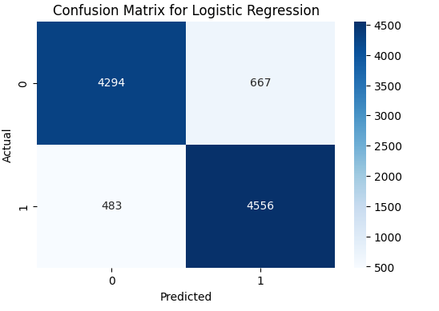
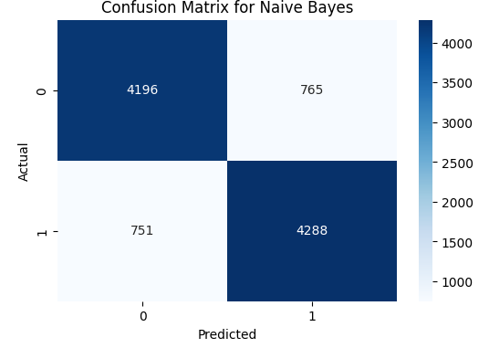
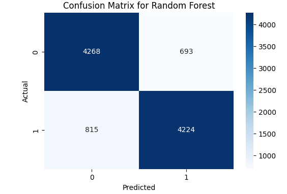
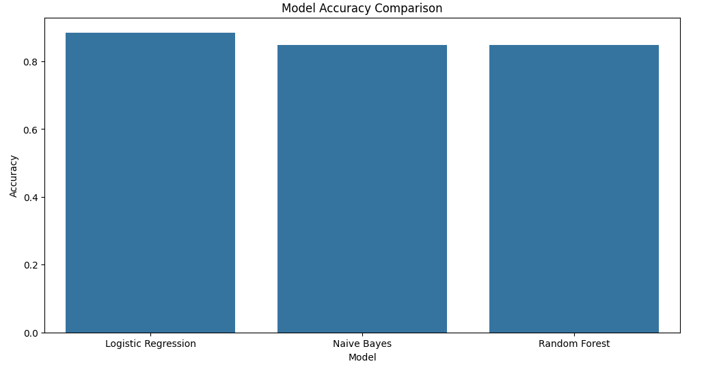
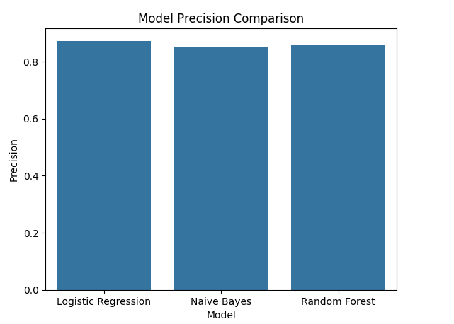
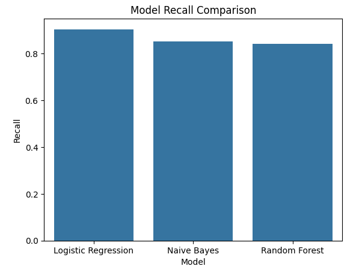

# Sentiment Analysis on IMDb

## Project Overview
This project implements a sentiment analysis model for IMDb movie reviews, leveraging three machine learning algorithms: Logistic Regression, Naive Bayes, and Random Forest. The dataset used is a collection of IMDb movie reviews, which are classified as either positive or negative. The project aims to compare the performance of these models using accuracy, precision, recall, and confusion matrices.

## Project Structure

```plaintext
sentiment_analysis_imdb/
│
├── data/
│   └── imdb_reviews.csv               # Dataset of IMDb reviews
│
├── images/                            # Visualizations
│   ├── cf_lr.png                      # Confusion matrix for Logistic Regression
│   ├── cf_nb.png                      # Confusion matrix for Naive Bayes
│   ├── cf_rf.png                      # Confusion matrix for Random Forest
│   ├── model_acc.png                  # Accuracy comparison of models
│   ├── model_pr.png                   # Precision comparison of models
│   ├── model_rc.png                   # Recall comparison of models
│
├── models/                            # Saved models
│   ├── tfidf_vectorizer.pkl           # TF-IDF vectorizer
│   ├── logistic_regression_model.pkl  # Logistic Regression model
│   ├── naive_bayes_model.pkl          # Naive Bayes model
│   ├── random_forest_model.pkl        # Random Forest model
│
├── notebooks/
│   └── Sentiment_Analysis.ipynb       # Jupyter notebook with full analysis
│
├── src/                               # Source code
│   ├── evaluation.py                  # Evaluation functions (accuracy, precision, recall)
│   ├── __init__.py                    # Package initialization
│   ├── main.py                        # Main file to run models
│   ├── model.py                       # Model training functions
│   └── preprocessing.py               # Data preprocessing functions
│
├── tests/                             # Unit tests
│   ├── test_evaluation.py             # Tests for evaluation functions
│   ├── test_main.py                   # Tests for the main script
│   ├── test_model.py                  # Tests for model training
│   └── test_preprocessing.py          # Tests for preprocessing functions
│
├── LICENSE.txt                        # License information
├── README.md                          # Project documentation
├── requirements.txt                   # Dependencies
└── .gitignore                         # Files to ignore in version control
# End of directory structure
```
## Getting Started

1. **Clone the repository**:
    ```bash
    git clone https://github.com/your-username/sentiment_analysis_imdb.git
    ```

2. **Install dependencies**:
    ```bash
    pip install -r requirements.txt
    ```

3. **Run the project**:
   You can run the models by executing the main script:
    ```bash
    python src/main.py
    ```

4. **Jupyter Notebook**:
    For detailed analysis and visualizations, open the Jupyter notebook:
    ```bash
    jupyter notebook notebooks/Sentiment_Analysis.ipynb
    ```

## Results

### Confusion Matrices

The confusion matrices for each model are shown below:

- **Logistic Regression**:
  
  

- **Naive Bayes**:
  
  

- **Random Forest**:
  
  

### Performance Comparison

The models' performance in terms of accuracy, precision, and recall are compared in the plots below:

- **Accuracy**:
  
  

- **Precision**:
  
  

- **Recall**:
  
  

## License
This project is licensed under the MIT License. See the [LICENSE.txt](LICENSE.txt) file for details.
